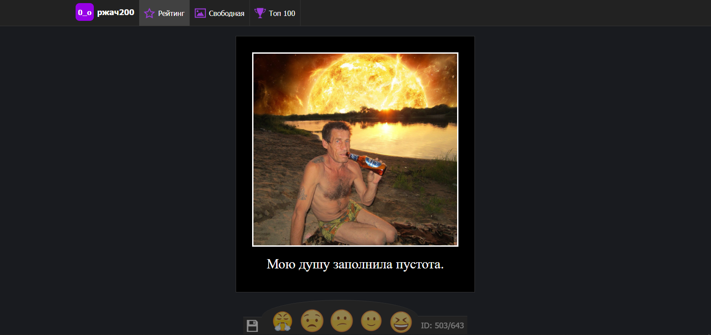
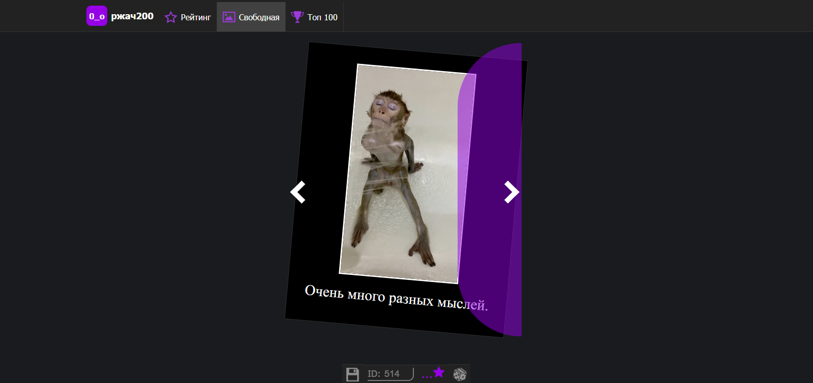
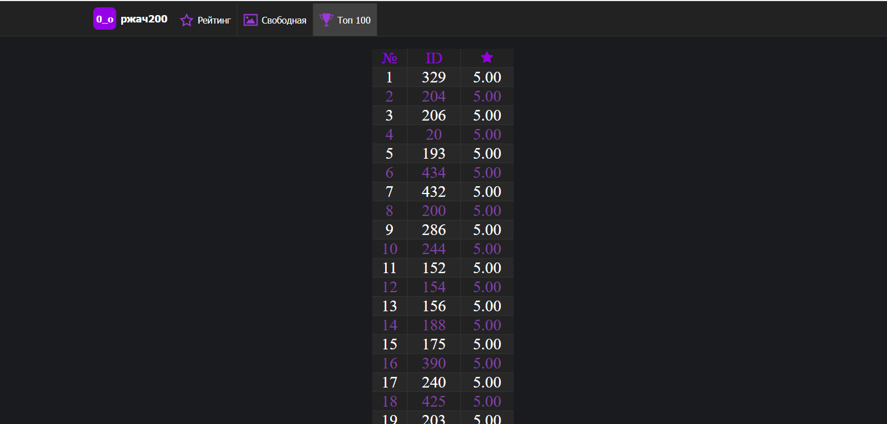

# Ржач200
Сайт для оценки сгенерированных аглоритмом демотиваторов.
Работает с помощью [VK API](https://dev.vk.com/reference) и [restdb](https://restdb.io/)
[Сайт](https://developer.android.com/training/dependency-injection/manual)

Принцип работы
---------------
1) Берется фото из [данного альбома](https://vk.com/album514918087_284198610)
2) К фото закрепляется случайная фраза из [данного сообщества](https://vk.com/four_words_ofic)
3) Оценка записываются в restdb

Функционал
-----------
* Генерация демотиваторов
* Возможность оценивать фото
* Свободный просмотр демотироватор
* Возможность скачать демотироватор
* Список лучших демотиваторов

-----------
 

